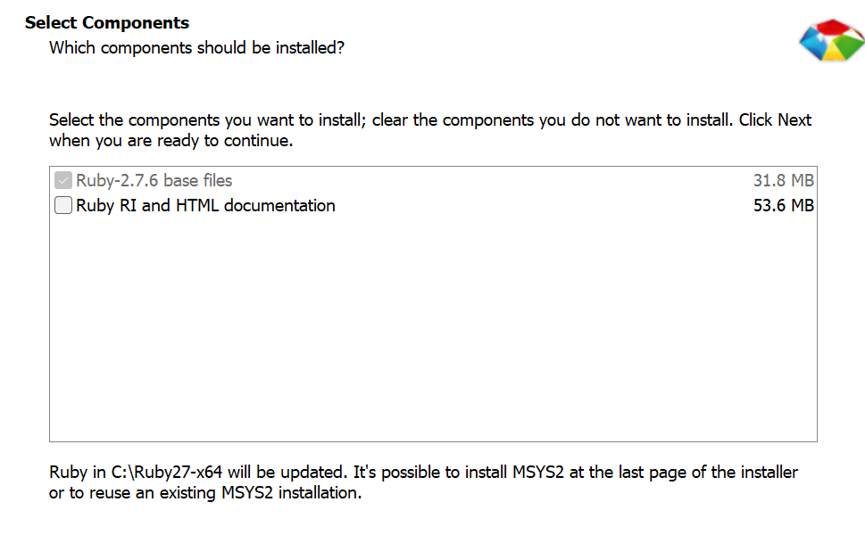
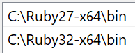
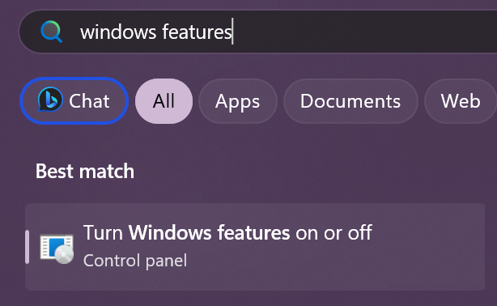
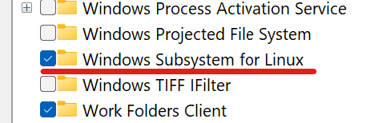

# fastlane
## Windows without WSL
### Installing Ruby and fastlane
1. Install a version of [RubyInstaller](https://rubyinstaller.org/downloads/archives/) that is 2.5 or later. (fastlane supports only Ruby versions 2.5 or later)
2. Only the base files are required. 
3. Check if Ruby is in your environment variables. 
4. In a terminal, run the following command to install fastlane and its dependencies. Note that this will add fastlane to the currently used Ruby version only. Use [RIDK](#ridk) to change versions.
   ```
 	gem install fastlane
5. You now have fastlane installed. 😄
   - In your project directory, you can now run fastlane commands. For example:
   ```
	fastlane android prepare

## Windows with WSL
### Enabling WSL
1. Search for "windows features" in your Start Menu and go to the following option. 
2. Enable the "Windows Subsystem for Linux" option. 
### Setting up Ruby and fastlane in a WSL terminal (You can also follow [these](https://docs.fastlane.tools/getting-started/android/setup/) steps instead)
1. Install a Ruby environment manager like [rbenv](https://github.com/rbenv/rbenv) or [RVM](https://rvm.io/) and install a Ruby version that is 2.5 or later. (fastlane supports only Ruby versions 2.5 or later)
2. Install Bundler.
   ```
	 gem install bundler
3. Install fastlane.
   ```
	 gem install fastlane

## Notes
### RIDK
- Before changing versions, you must have other Ruby versions installed by RubyInstaller.
- To see the versions you have installed, run
  ```
	ridk use list

- To change to a version, run
  ```
	ridk use <option number>
	```
	In this case, \<option number> can be 1 or 2.

### Problems I encountered
- Linux and Windows use different line endings.
  - If you are coming from Windows into Linux or vice versa, make sure to re-install your modules.
- Linux and Windows use slightly different Android SDKs.
  - Follow [these](https://halimsamy.com/wsl-for-developers-installing-the-android-sdk) steps to install an Android SDK on WSL.
  - Also remember to change your sdk.dir in your project's android/local.properties